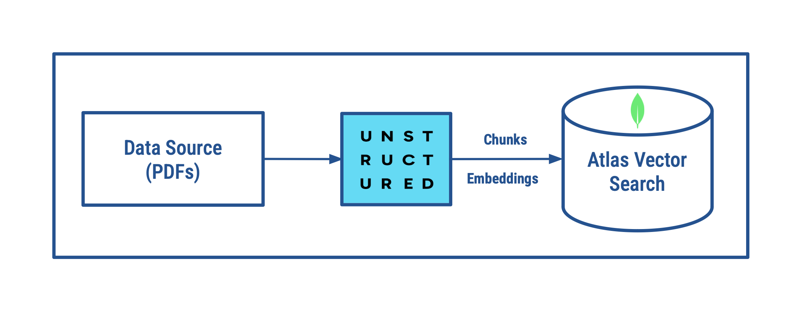

# thedocchopper

## Description
thedocchopper chunks documents using Unstructured.io and stores them in the MongoDB vector database.

## Features
**Document Chunking:** Utilizes unstructured.io to efficiently chunk documents into manageable pieces for better storage and retrieval.   
**MongoDB Storage:** Stores document chunks in MongoDB for fast and reliable access.   

## Tech Stack
**Python:** The core programming language used for the application logic.   
**Unstructured.io:** Used for document chunking and processing.   
**MongoDB:** A NoSQL database for storing document chunks.   

## Installation
### Prerequisites
Before you begin, ensure you have met the following requirements:   
- Python 3.8 or higher   
- MongoDB  

## Architecture


### Clone the Repository
```
git clone https://github.com/vigneshwarie/thedocchopper.git
cd thedocchopper
```
### Set Up the Virtual Environment
Create and activate a virtual environment:
```
python -m venv .venv
source .venv/bin/activate
```
### Install Dependencies
Install the necessary packages from requirements.txt:    
```
pip install -r requirements.txt
```
### Configuration
Create a .env file in the root directory of your project and add your MongoDB URI:    
```
MONGODB_CONNECTION_STRING=your_mongodb_uri
MONGODB_DB_NAME=your_mongodb_db_name
MONGODB_COLLECTION_NAME=your_mongodb_collection_name
```
### Run the Application
Start the application:    
```
python3 app.py
```
## License
  
